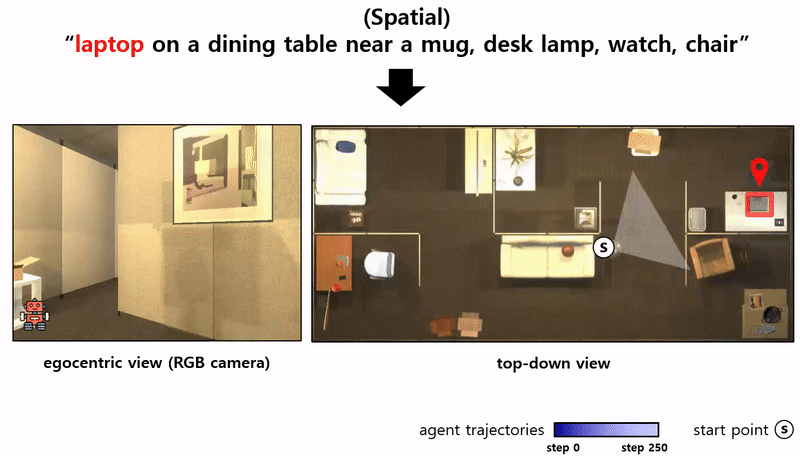
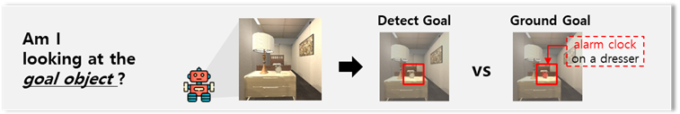
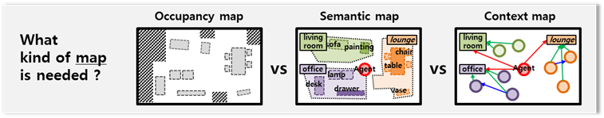
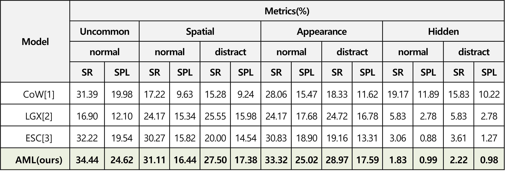
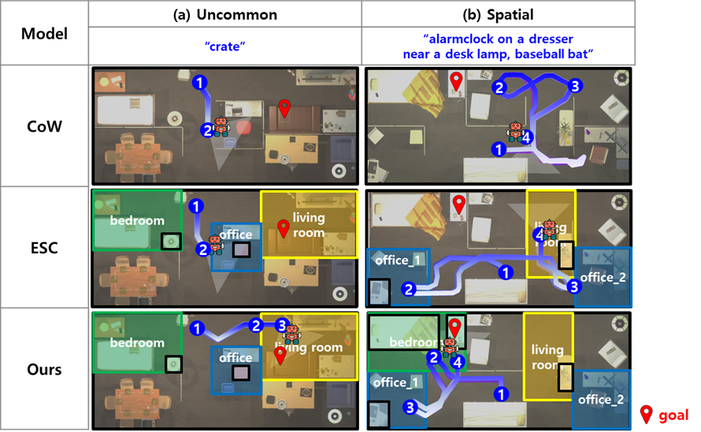
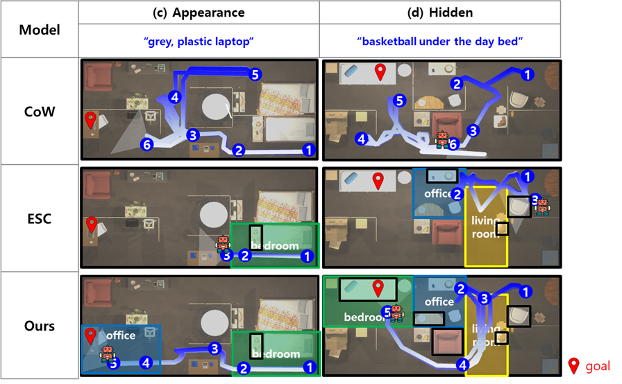

# 언어 기반 제로-샷 물체 목표 탐색 이동 작업들을 위한 인공지능 기저 모델들의 활용
**Utilizing AI Foundation Models for Language Driven Zero-Shot Object Navigation Tasks**
**(Journal of Korea Robotics Society, 2024)**
###### [[Paper]](https://jkros.org/xml/41654/41654.pdf)


<div style="margin:50px; text-align: justify;">


본 연구는 언어 기반 제로-샷 물체 목표 탐색 이동(Language-Driven Zero-Shot Object Navigation, L-ZSON) 작업을 위한 새로운 에이전트 모델을 제안합니다. <p>
L-ZSON은 로봇 에이전트가 이전에 경험하지 않은 미지의 환경에서 자연어 묘사와 실시간 RGB-D 입력 영상만을 활용하여 목표 물체를 탐색하고 이동 계획을 수립하며 실행하는 작업입니다.
</div>

<div style="margin:50px; text-align: justify;">
이 모델은 아래와 같은 세 가지 주요 과제를 해결합니다: <br>
<p> 1. 목표 물체 그라운딩(Target Object Grounding): 자연어 묘사를 기반으로 목표 물체를 정확히 식별합니다. 이는 물체의 속성이나 다른 물체와의 공간적 관계를 고려하여 실시간 RGB 영상에서 목표 물체와 방을 탐지합니다.</p>

<br> <br>
<p> 2. 공간적 맥락 지도 생성(Spatial Context Map Generation): 실시간 RGB-D 입력 영상으로부터 에이전트가 환경을 이해하고, 물체와 방 간의 공간적 관계를 반영한 의미적 맥락 지도를 생성합니다.</p>

<br> <br>
<p> 3. 효율적인 탐험 행동(Efficient Exploratory Actions): 목표 물체가 시야에 들어오기 전까지 효율적인 탐색 행동을 수행할 수 있도록 탐험 경로를 최적화합니다.</p>

<br> <br>
</div>

This repository contains code for CoWs on Pasture.

## Dependencies

Create the conda environment:
```sh
conda env create -f environment.yml
```
Activate the environment:
```sh
conda activate lzson_agent
```

```
python scripts/test_torch_download.py
```
## Prepare
### Pasture 데이터 집합 다운로드
Pasture THOR binaries (~4GB)
```sh
wget https://cow.cs.columbia.edu/downloads/pasture_builds.tar.gz
```
```sh
tar -xvf pasture_builds.tar.gz
```

### 각 에피소드, 평가용 데이터 다운로드
```sh
wget https://cow.cs.columbia.edu/downloads/datasets.tar.gz
```
```sh
tar -xvf datasets.tar.gz
```

---
### **📂 Directory Structure**

```
src
├── models
│   ├── agent_fbe.py
│   ├── agent.py
│   ├── exploration
│   │   ├── frontier_based_exploration.py
│   ├── prompting
│   │   ├── ContextMapGeneration.py
│   │   ├── LLM_Llama2_7b.py
│   │   ├── LLM_Prompting.py
├── shared
│   ├── data_split.py
│   └── utils.py
└── simulation
    ├── constants.py
    ├── sim_enums.py
    ├── utils.py
    └── visualization_utils.py
```

#### 주요 모듈 설명

- **에이전트 구조**:
  - 모든 에이전트는 `src/models/agent.py`를 기반으로 하며, 이는 [RoboTHOR](https://github.com/allenai/robothor-challenge/blob/main/robothor_challenge/agent.py)에서 확장하였습니다.

- **프론티어 기반 탐험(FBE)**:
  - `src/models/exploration/frontier_based_exploration.py`에 구현되어 있으며, 목표를 찾기 전 탐험을 위한 알고리즘의 핵심 로직을 포함합니다.
  - 이는 [CoWs_on_Pasture](https://github.com/real-stanford/cow)에 공간적 맥락 지도 구성 방법을 신규 추가하여 확장하였습니다.
  - `src/models/agent_fbe.py`에서는 이 FBE 알고리즘을 템플릿으로 사용하여 목표를 발견한 후 이를 활용하는 기본 알고리즘을 포함하고 있습니다. 
  - 
- **Context Map Generation (CMG)**:
  - `src/models/prompting/ContextMapGeneration.py`에 구현된 모듈로, 그래프 노드 형태의 의미적 물체 지도 작성과 물체들 간의 공간 관계를 통해 맥락 지도를 생성합니다.
 
- **Context-based LLM Prompting (CLP)**:
  - `src/models/prompting/LLM_Prompting.py`에 구현된 모듈로, 맥락 정보를 기반으로 목표가 있을 법한 방과 목표 근처에 있을 법한 물체들의 정보들을 LLM에게 질의합니다.

- **로컬라이제이션(Localization)**:
  - `src/models/localization/` 디렉토리 내 모듈은 목표가 시야에 들어왔을 때 해당 목표를 식별할 수 있는 로직을 포함하고 있습니다.

---


## Run Code on Pasture and RoboTHOR

```
python pasture_runner.py -a src.models.agent_fbe_lzson -n 8 --arch B32 --center
```

Note: this automatically evaluates all Pasture splits and RoboTHOR. 


### Visualization on Pasture

```
python path_visualization.py --out-dir viz/ --thor-floor FloorPlan_Val3_5 --result-json media/media_data/FloorPlan_Val3_5_GingerbreadHouse_1.json --thor-build pasture_builds/thor_build_longtail/longtail.x86_64
```

The script outputs 1) egocentric pngs for each view, 2) an mp4 for the egocentric feed, 3) top-down pngs for each pose, 4) an mp4 for the top-down feed.

### Evaluation

```
python success_agg.py --result-dir results/longtail_longtail_fbe_owl-b32-openai-center/
```

---
## Result
### 정량적 평가
- 

### 정성적 평가
- 
- 
---

## Paper

```bibtex
@article{최정현2024언어,
  title={언어-기반 제로-샷 물체 목표 탐색 이동 작업들을 위한 인공지능 기저 모델들의 활용},
  author={최정현 and 백호준 and 박찬솔 and 김인철},
  journal={로봇학회 논문지},
  volume={19},
  number={3},
  pages={293--310},
  year={2024}
}
```

---

## Acknowledgement

제안 모델은 [2021 RoboTHOR Challenge](https://github.com/allenai/robothor-challenge) , [CoWs on Pasture](https://github.com/real-stanford/cow), [ESC](https://arxiv.org/pdf/2301.13166)의 일부 코드를 기반으로 구현되었습니다.

---